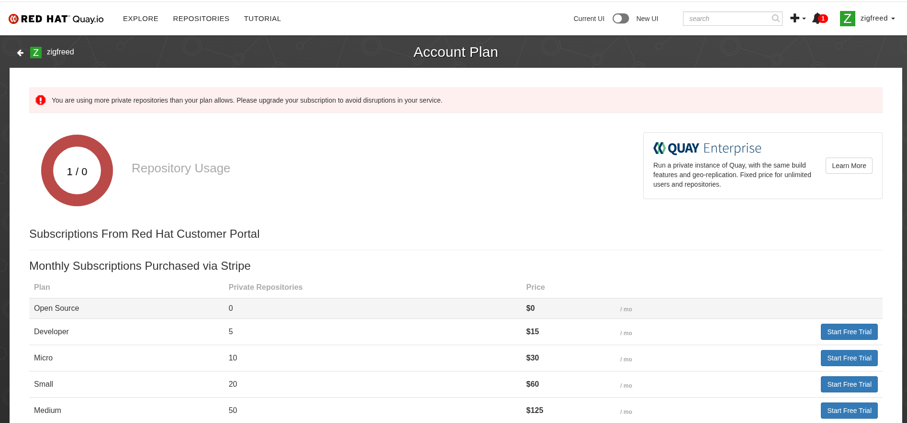

# image.builder.pipeline

The image factory. It takes a Red Hat Image Builder blueprint and returns a
CIS-hardened machine image together with the evidence that it *is* hardened — an
AWS AMI or an OpenShift Virtualization containerDisk, plus OpenSCAP scan results
parsed into policy data that OPA can enforce against. Hardening an image is the
straightforward half. Proving it stayed hardened is the half that gets asked
about with a customer in the room, and that is what the scan and generate stages
are for.

| | |
|---|---|
| **For** | Anyone who needs a hardened base image *and* the compliance evidence behind it |
| **Produces** | CIS L1 AMIs, containerDisks on Quay.io, and `data.json` policy data |
| **Run it** | One `ansible-playbook` per stage — see [Getting started](#getting-started) |
| **Status** | RHEL 9 complete — OpenSCAP 98.07 against a 95-point gate. See [Supported platforms](#supported-platforms) |

**This repo is the producer**, and the dependency only ever runs outward:
[sales.demos](https://github.com/ericcames/sales.demos) consumes the images,
[rego_policy_libraries](https://github.com/ynotbhatc/rego_policy_libraries)
consumes the compliance data, and nothing here depends on either. See
[Related repositories](#related-repositories).

## Getting started

**Consuming the images?** You do not need this repo. The AMIs and containerDisks
are published, and the only thing binding a consumer to this repo is one image
tag. Go to [sales.demos](https://github.com/ericcames/sales.demos) — it points a
cluster at a published containerdisk and never builds one. Nothing below applies
to you.

**Building or publishing an image?** New machine, or a fresh clone? **Start with
the `first-time` skill.** It validates every local prerequisite — the Automation
Hub token, the collections, and the AWS credential pattern — and touches no AWS
or Red Hat API doing it:

```bash
git clone https://github.com/ericcames/image.builder.pipeline.git
cd image.builder.pipeline
claude .
# then:  /first-time
```

[`.claude/skills/first-time/SKILL.md`](.claude/skills/first-time/SKILL.md) is
written to be *run* as a skill in Claude Code, but its Step 0 audit is a plain
shell block — paste it into a terminal and work down the list by hand if you do
not have Claude Code.

### Prerequisites

- Red Hat account with Image Builder access (console.redhat.com)
- Red Hat offline token in `~/.ansible.cfg` under `[galaxy_server.rh_certified]` as `token=`
  (same token used for Automation Hub — obtain from console.redhat.com → Automation Hub → Connect to Hub → API token)
- AWS credentials with EC2 permissions
- Ansible collections (installed via requirements.yml)

```bash
ansible-galaxy collection install -r collections/requirements.yml -p ./collections
```

### AMI pipeline (AWS)

```bash
cp -r inventories/sample/ inventories/<customer>-<platform>/

export AWS_ACCESS_KEY_ID=<key>
export AWS_SECRET_ACCESS_KEY=<secret>
export AWS_DEFAULT_REGION=us-east-1
export AWS_ACCOUNT_ID=<your_aws_account_id>

ansible-playbook -i inventories/<customer>-<platform>/ playbooks/build_cis_image.yml
ansible-playbook -i inventories/<customer>-<platform>/ playbooks/deploy_and_scan.yml
ansible-playbook -i inventories/<customer>-<platform>/ playbooks/generate_policy_data.yml
```

### containerDisk pipeline (OpenShift Virt)

```bash
podman login quay.io                  # one-time setup
# QUAY_REPO defaults to quay.io/zigfreed/rhel9-cis-l1-golden
ansible-playbook playbooks/build_cis_containerdisk.yml
```

### Working across both repos

Most work needs only one of the two. Some spans both — the edge / SNO demo does
by construction, since the installer ISO is built here and the cluster is
configured in `sales.demos`.

When it does, clone both and **start the agent in `sales.demos`, not here**:

```bash
git clone https://github.com/ericcames/sales.demos.git
git clone https://github.com/ericcames/image.builder.pipeline.git
cd sales.demos
claude .
```

That repo's `.mcp.json` is project-scoped, so its cluster servers load only in a
session started in *that* directory — and **this repo has no MCP servers at
all**, so a session started here gets no cluster tools. From there you can
`cd ../image.builder.pipeline` and run these playbooks anyway, because the
working directory does not restrict shell access. Better in one direction only.

**This repo's skills are the exception.** Skills are discovered from the
directory the agent starts in, so `first-time`, `dev-workflow`,
`rhel9-containerdisk` and `windows-image-build` are **not** reachable from a
session started in `sales.demos`. Open a second session here to use them.

## Overview

This pipeline automates four stages:

1. **Build** — trigger a CIS-hardened image compose via the Red Hat Image Builder API (AMI or qcow2)
2. **Scan** — deploy the image to AWS and extract OpenSCAP results (AMI path)
3. **Generate** — parse SCAP results into `data.json` policy data files
4. **containerDisk** — wrap qcow2 as a containerDisk and push to Quay.io for OpenShift Virtualization

The output feeds directly into the `golden_images/` policy module in `rego_policy_libraries`,
populating approved baseline values, exempt controls, and compliance thresholds.

## Architecture

```
Red Hat Image Builder (console.redhat.com)
        │
        ├──────────────────────────┐
        ▼ AMI                     ▼ qcow2
   AWS EC2 (temp instance)   containerDisk wrap
        │                         │
        ▼ SCAP results            ▼ podman push
   OpenSCAP Parser           Quay.io
        │                         │
        ▼                         ▼
   data.json → rego_policy    DataImportCron →
   _libraries/golden_images/  OpenShift Virt VMs
```

## Supported platforms

| Platform | Output | CIS Benchmark | Status |
|----------|--------|--------------|--------|
| RHEL 9 | AMI | CIS Level 1 Server | **Phase 1 — Complete** (score 98.07 / 95 gate — see [status](docs/cis-l1-rhel9-status.md)) |
| RHEL 9 | containerDisk | CIS Level 1 Server | **Phase 1.7 — Complete** (public repo) |
| RHEL 8 | AMI | CIS Level 1 Server | Phase 2 |
| RHEL 10 | AMI | CIS Level 1 Server | Phase 2 — pending benchmark |
| Windows Server 2022 | containerDisk | CIS Level 1 | Phase 3 (private repo — see [Quay.io entitlement](#quayio-private-repo-entitlement)) |

See [ROADMAP.md](ROADMAP.md) for full platform schedule and
[docs/cis-l1-rhel9-status.md](docs/cis-l1-rhel9-status.md) for the
latest RHEL 9 compliance snapshot.

## Claude skills

Workflows in this repo are packaged as skills under `.claude/skills/`.

| Skill | Does |
|---|---|
| `first-time` | Validates every local prerequisite on a new machine |
| `collections-sync` | Pins, installs and verifies the Ansible collections |
| `dev-workflow` | The mandatory issue → branch → PR → merge cycle |
| `rhel9-containerdisk` | Builds the RHEL 9 CIS L1 containerDisk (Phase 1.7) |
| `windows-image-build` | Builds the Windows Server 2022 containerDisk (Phase 3) |

## Output

Generated `data.json` files are written to `output/<platform>/data.json` and
should be copied into the appropriate `golden_images/` path in `rego_policy_libraries`.

## CI / Automation

| Workflow | Trigger | What it does |
|---|---|---|
| [`lint.yml`](.github/workflows/lint.yml) | Push / PR to `main` | yamllint + ansible-lint on `playbooks/` and `inventories/` |
| [`containerdisk-rebuild.yml`](.github/workflows/containerdisk-rebuild.yml) | Monthly (1st, 06:00 UTC) + manual | Rebuilds the RHEL 9 CIS L1 containerDisk and pushes to Quay.io |

The scheduled rebuild keeps the containerDisk fresh with RHEL errata and CIS
benchmark updates without operator intervention. Trigger a manual rebuild from
the Actions tab or via `gh workflow run "Rebuild RHEL 9 CIS containerDisk"`.
See [docs/operations.md](docs/operations.md) for the full operational runbook.

## Related repositories

This repo is the **producer**. Both links below are consumers — the dependency
runs outward from here.

| Repo | Receives | Contract |
|---|---|---|
| [sales.demos](https://github.com/ericcames/sales.demos) | RHEL AMIs and the Windows Server 2022 containerDisk | AMI tags (`docs/design.md` §9); a containerdisk tag for Windows |
| [rego_policy_libraries](https://github.com/ynotbhatc/rego_policy_libraries) | `data.json` compliance data under `golden_images/` | `docs/design.md` §6 |

**The Windows golden image is deliberately split across two repos.** Building and
publishing it is [#24](https://github.com/ericcames/image.builder.pipeline/issues/24)
here; pointing a cluster at the published image is
[sales.demos#3](https://github.com/ericcames/sales.demos/issues/3), which has
shipped and is waiting on a tag. **The only thing binding them is one string — a
containerdisk tag in a private quay repo.**

That split is the rule in `CLAUDE.md`: *"Producer/consumer across repos is
intentional. Different audiences, different lifecycles."* Hardening and
compliance evidence belong here; running demos belongs there.

## Quay.io private repo entitlement

The Windows containerDisk is published to a **private** Quay.io repository
(Microsoft licensing prohibits public redistribution). The RHEL containerDisk
is public and needs no special entitlement.

The free Open Source plan on Quay.io includes **0 private repositories**. To
host the Windows image, you need at least the Developer plan (5 private repos,
$15/mo) or a Red Hat developer subscription that includes private repo
entitlement. Without it, Quay shows this warning:



If you are a Red Hat associate, open a support case requesting a developer
subscription with private Quay.io repo access. The existing private repo
continues to function while the notification is active — it is a warning, not
a block.

## License

MIT — see [LICENSE](LICENSE)
