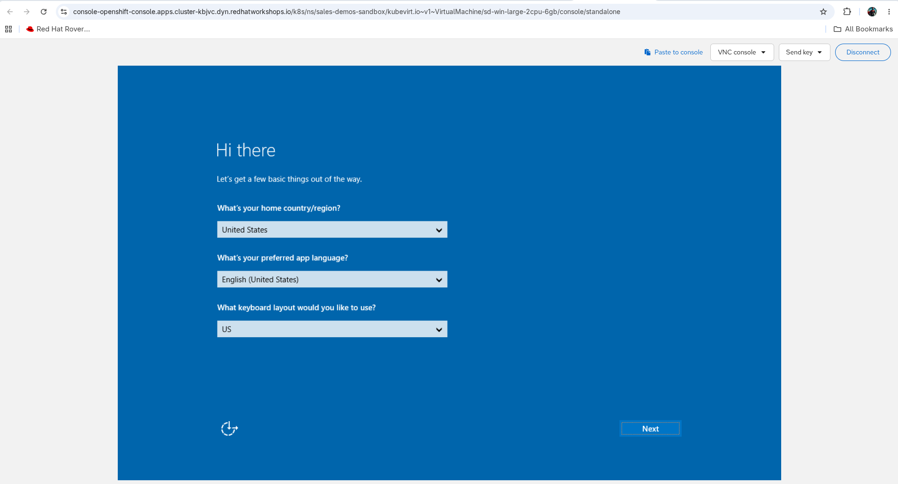
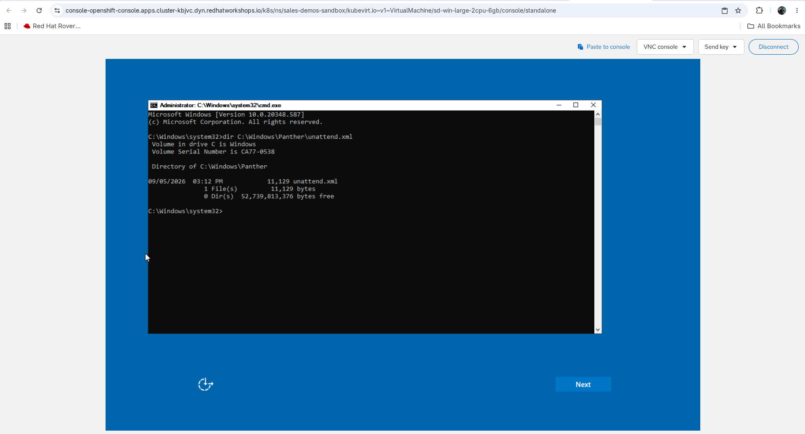
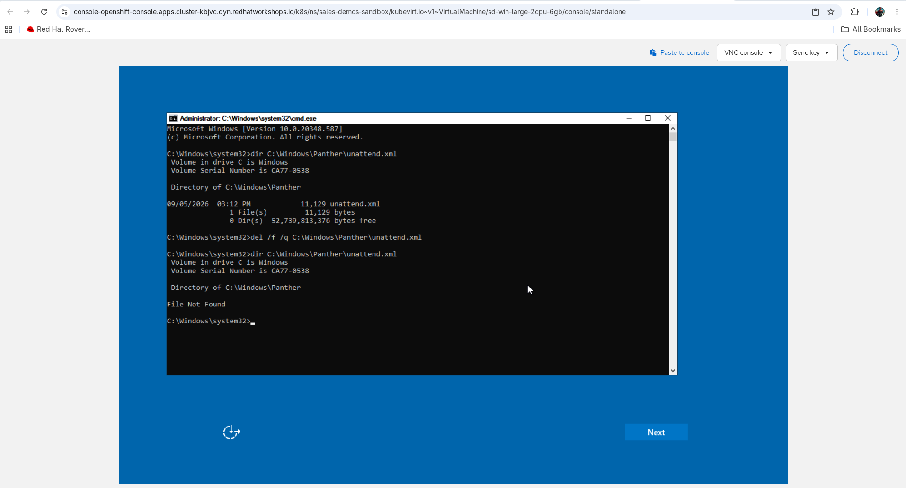
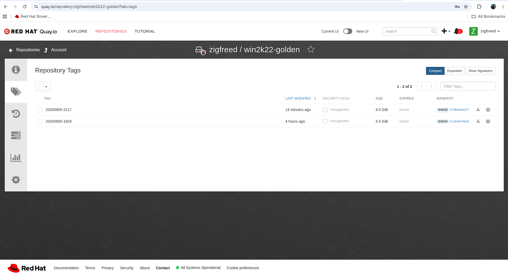

# Golden Image Pipeline — Design Document

**Status:** Draft
**Maintainer:** ericcames
**Companion repo:** [rego_policy_libraries](https://github.com/ynotbhatc/rego_policy_libraries)
**Last updated:** 2026-09-05

---

## 1. Purpose

This pipeline automates the construction, scanning, and compliance reporting of
hardened machine images. It produces structured `data.json` files consumed by the
`golden_images/` policy module in `rego_policy_libraries`.

Unlike the `benchmarks/` policies in that repo — which assess the *running state*
of a live system — golden image policies assert the *provenance and build-time
compliance* of an image artifact. This pipeline generates the reference data those
policies evaluate against.

---

## 2. Problem Statement

Without automated image compliance data generation, teams must:

- Manually run builds and scans each time a new image is needed
- Hand-curate allowlists and denylist that drift from reality
- Rediscover platform-specific exceptions (e.g., AWS boot partition layout) on every new build
- Struggle to prove image provenance to auditors (FedRAMP, CMMC, PCI-DSS)

This pipeline closes that gap: a single playbook run produces an authoritative,
machine-readable compliance record.

---

## 3. Pipeline Stages

### Stage 1 — Build (`build_cis_image.yml`)

Calls the Red Hat Image Builder API to:
- Create an image blueprint with the target CIS OpenSCAP profile
- Trigger an AWS AMI compose
- Poll until the compose completes
- Record the resulting AMI ID

**Key API:** `https://console.redhat.com/api/image-builder/v1/`

**Authentication:** Red Hat offline token (`RH_OFFLINE_TOKEN` env var)

**Blueprint profile:** `xccdf_org.ssgproject.content_profile_cis_server_l1`

Image Builder runs OpenSCAP at build time and writes results to
`/root/openscap_data/` inside the image.

---

### Stage 2 — Deploy and Scan (`deploy_and_scan.yml`)

- Launches a temporary EC2 instance from the AMI produced in Stage 1
- SSHs in and pulls `/root/openscap_data/` results
- Optionally re-runs a fresh OpenSCAP scan to capture runtime state
- Terminates the instance and cleans up

**Authentication:** AWS credentials via standard env vars

---

### Stage 3 — Generate Policy Data (`generate_policy_data.yml`)

Parses the XCCDF/ARF results, merges scan-derived data with curated policy
inputs, and produces `output/<platform>/data.json`:

```json
{
  "approved_base_images": ["ami-0228edcda0bbb6c3a"],
  "approved_builders": ["imagebuilder", "packer", "ansible-aac"],
  "approved_signing_keys": [],
  "max_image_age_days": 90,
  "min_hardening_score": 95,
  "required_packages": ["aide", "audit", "firewalld", "openscap-scanner"],
  "denied_packages": ["telnet", "rsh", "xinetd"],
  "exempt_controls": [
    {
      "control_id": "xccdf_org.ssgproject.content_rule_grub2_password",
      "severity": "P1",
      "reason": "Cloud VMs do not expose the console boot path that a grub2 password protects ...",
      "applies_to": ["aws_ami"]
    }
  ]
}
```

- `approved_base_images` is populated from `output/<platform>/build_output.json`
  (the AMI ID minted by Stage 1).
- `exempt_controls` is a merge of two sources: curated entries from
  `playbooks/vars/exempt_controls.yml` (canonical reasons; see §5) plus any
  low-severity scan failures auto-emitted by the XCCDF parser. Curated entries
  win on duplicate `control_id` so canonical reasons replace auto-emitted
  placeholders.
- The remaining fields (`approved_builders`, thresholds, package lists) are
  static policy inputs defined in `playbooks/generate_policy_data.yml`.

---

## 4. Credential Model

All credentials are resolved at runtime via environment variables — never stored in the repo.

| Variable | Purpose |
|----------|---------|
| `RH_OFFLINE_TOKEN` | Red Hat API access (Image Builder) |
| `AWS_ACCESS_KEY_ID` | AWS authentication |
| `AWS_SECRET_ACCESS_KEY` | AWS authentication |
| `AWS_DEFAULT_REGION` | Target AWS region |
| `K8S_AUTH_HOST` | OpenShift API URL for the Windows containerDisk build (#24) |
| `K8S_AUTH_API_KEY` | OpenShift bearer token for the same |
| `WINDOWS_ADMIN_PASSWORD` | Local Administrator password baked into the Windows image (#24) |

**CI/CD secrets** (GitHub Actions, for the scheduled containerDisk rebuild):

| Secret | Maps to | Used by |
|--------|---------|---------|
| `RH_OFFLINE_TOKEN` | Written to `~/.ansible.cfg` on the runner | `containerdisk-rebuild.yml` — Image Builder API |
| `QUAY_USERNAME` | `podman login` username | `containerdisk-rebuild.yml` — Quay push |
| `QUAY_PASSWORD` | `podman login` password | `containerdisk-rebuild.yml` — Quay push |

### 4.1 Where the Windows build's variables come from

The three Windows variables are **maintained in `sales.demos`, not here**, and
this is the only record of that. Working it out from scratch means searching
another repo's vault, which has now been done twice.

| Variable | Source in `sales.demos` | |
|---|---|---|
| `K8S_AUTH_HOST` | `inventory/group_vars/sandbox/connection.yml` → `openshift_api_url` | committed plaintext |
| `K8S_AUTH_API_KEY` | `playbooks/group_vars/all/secrets.yml` → `env_secrets.sandbox.openshift_api_token` | vault |
| `WINDOWS_ADMIN_PASSWORD` | `playbooks/group_vars/all/secrets.yml` → `windows_admin_password` | vault |

The vault password lives outside both repos at
`~/secrets/.vault_pass_sales_demos`. The API URL embeds a live RHDP cluster ID,
so it is deliberately **not** reproduced here — read it from the file above,
which is where it is kept current anyway.

**This does not couple the two repos.** The playbook reads environment variables
and nothing else; no task loads a vault, and `sales.demos`' secrets mechanism is
not imported. What is recorded here is where a *human* fills those variables in.
The distinction matters in both directions: the producer stays runnable by
someone who has never seen `sales.demos`, and the person who does have it does
not invent a second copy of a credential that is already maintained.

**Do not materialise them into a committed file.** `sales.demos` deliberately
allows exactly one secrets file and no sourceable second copy; the same reasoning
applies here. Export them into the shell that runs the playbook, or pass them
with `-e`, and let them expire with the process.

The OpenShift variables point at the **sandbox** environment. Builds never run
against the demo environment — a 45-minute Windows install has no business on a
cluster someone might be presenting from, and `build_windows_image.yml` asserts
against it. The consumer reaches the artifact through a published containerdisk
tag, not through this cluster.

---

## 5. Exempt Controls Design

CIS rules that fail at scan time fall into two categories:

1. **Real hardening gaps** — packages missing, services not enabled, config not applied.
   Fixed in `build_cis_image.yml` blueprint customizations so the rule passes on rebuild.
2. **Structural mismatches with the deployment environment** — rules that can't apply
   on AWS regardless of how the image is built (no console boot recovery, no separate
   partitions, SSH-key-only auth model). Treated as exempt with documented reasons.

Category 2 entries live in `playbooks/vars/exempt_controls.yml`, keyed by platform, and
get merged into `data.json` under `exempt_controls` at policy-data generation time.
This list is managed in the pipeline repo rather than hardcoded in OPA policy — a data
file update is sufficient when exceptions change; no policy code review required.

The parser (`playbooks/filter_plugins/xccdf.py`) also auto-emits low-severity (XCCDF
`low` → policy P3) scan failures as exempt candidates. Curated entries take precedence
on duplicate `control_id` so the canonical reason is preserved.

### 5.1 Severity mapping

Policy severity maps from XCCDF severity:

| XCCDF severity | Policy severity | Notes |
|---|---|---|
| high | P1 | Highest gating impact |
| medium | P2 | |
| low | P3 | Auto-emitted as exempt by default |
| unknown / info | P3 | SSG didn't assign a severity — treated as lowest gating weight |

### 5.2 Canonical curated entries (RHEL 9, AWS)

| Control | XCCDF | Policy | Reason |
|---|---|---|---|
| `grub2_password` | high | P1 | Cloud VMs don't expose the console boot path that grub2 password protects. Baking a password into the AMI is ineffective (no console-recovery path on AWS) and a credential-leak risk (password stored in the image artifact). |
| `ensure_root_password_configured` | medium | P2 | RHEL on AWS uses `ec2-user` with SSH key authentication; root password is not part of the security model. Setting one provides no defense against an attacker who can already reach the instance and creates a credential leak risk in the AMI artifact. |
| `partition_for_tmp` | low | P3 | AWS EBS-backed AMIs use a single root partition that cloud-init expands at first boot. A separate `/tmp` partition is incompatible with that launch flow. |
| `file_permission_user_init_files` | medium | P2 | Rule applies to user home directories on a deployed system. At AMI build time no users exist yet — `ec2-user` is created by cloud-init at first boot, not in the image artifact. Hardening user init file permissions is a post-deploy responsibility. |
| `sshd_limit_user_access` | unknown | P3 | SSH access policy (`AllowUsers`/`AllowGroups`/etc.) is a consumer decision: the pipeline produces a base OS image and does not know which users or service accounts downstream setup will require SSH access. Baking `AllowUsers ec2-user` would risk locking out legitimate downstream users. |

Source: `playbooks/vars/exempt_controls.yml`. Update both files together when the list changes.

---

## 6. Integration with rego_policy_libraries

Generated `data.json` files map to:

```
rego_policy_libraries/
└── golden_images/
    └── os/
        └── linux/
            └── rhel_9/
                └── data.json    ← output of this pipeline
```

The OPA policies reference this data as:
```rego
input.image.source_image_id in data.golden_images.rhel9.approved_base_images
input.image.builder in data.golden_images.rhel9.approved_builders
```

---

## 7. OPA Policy Module Reference

The following modules in `rego_policy_libraries` consume the data this pipeline produces:

| Module | Data fields consumed |
|--------|---------------------|
| `image_provenance.rego` | `approved_base_images`, `approved_builders`, `max_image_age_days` |
| `hardening_baseline.rego` | `min_hardening_score`, `exempt_controls` |
| `package_policy.rego` | `required_packages`, `denied_packages` |
| `image_signing.rego` | `approved_signing_keys` |

---

## 8. Full Golden Image Policy Design

For the complete OPA policy design — module taxonomy, input schema, output contract,
severity tiers, and enforcement integration — see the policy design document maintained
by the `rego_policy_libraries` repo owner.

Key decisions made during planning (2026-04-22):

- **data.json over hardcoded values** — lists change independently of policy logic
- **Image Builder as primary build tool** — OpenSCAP runs at build time, results embedded in image
- **OpenSCAP profile ID normalization** — Image Builder uses full XCCDF IDs; policy must handle both short and full form
- **P1 gate logic in orchestrator only** — individual modules emit severity-tagged violations; `rhel9_golden_image_main.rego` decides ALLOW/DENY
- **Exempt controls enumerated by this pipeline** — not hardcoded in Rego
- **RHEL 9 before Windows** — establish patterns on the well-defined platform first

---

## 9. Downstream consumers

A second consumer of this pipeline's output, distinct from `rego_policy_libraries`.
[`sales.demos`](https://github.com/ericcames/sales.demos) consumes the **AMIs
themselves** — not `data.json` — as the boot image for its Layer 1 Satellite host
and Layer 3 RHEL workload nodes.

**Status:** Pipeline applies the tagging contract below as of Phase 1.5. The
`sales.demos` tag-filter swap is the remaining Phase 1.5 work.

### 9.1 Discovery mechanism — tag-based

Consumer Terraform discovers AMIs via `data "aws_ami"` with tag filters. Tag-based
discovery is more flexible than name-pattern matching: consumers can filter on
any combination of provenance / OS / level without coupling to a specific name
format.

```hcl
data "aws_ami" "rhel9_cis_l1" {
  owners      = ["463606842039"]
  most_recent = true

  filter {
    name   = "tag:Pipeline"
    values = ["image-builder-pipeline"]
  }
  filter {
    name   = "tag:OS"
    values = ["rhel9"]
  }
  filter {
    name   = "tag:CIS-Level"
    values = ["L1"]
  }
}
```

`owners = ["463606842039"]` reflects how Red Hat Image Builder actually
delivers AMIs: it is a **hosted service** that builds in Red Hat's own AWS
service account (`463606842039`) and shares the result with the consumer
account named in the API's `share_with_accounts` field. The consumer never
owns the AMI — only has launch permission for it — so `owners = ["self"]`
in the data source would not match. Consumers must filter on the Image
Builder service account ID instead.

`most_recent = true` picks the freshest matching build, which is also
reflected in the `BuildDate` tag for explicit age checks.

### 9.2 AMI tagging contract

The pipeline applies six tags to every AMI it produces. These are the versioned
cross-repo contract with downstream consumers:

| Tag | Value | Why |
|---|---|---|
| `Pipeline` | `image-builder-pipeline` | Provenance — filter to pipeline-built only |
| `OS` | `rhel9`, `rhel8`, `win2022` | Filter dimension |
| `CIS-Level` | `L1`, `L2` | Workload groups may select level |
| `BuildDate` | ISO 8601 timestamp (e.g. `2026-05-12T01:00:00Z`) | Age tracking |
| `ComposeID` | Image Builder compose UUID | Traceability back to pipeline logs |
| `Name` | `{os}-cis-l{level}-{YYYYMMDD-HHMM}` (e.g. `rhel9-cis-l1-20260512-0100`) | Human-readable label for AWS console / CLI listings |

The `Name` tag follows a stable pattern but is *not* a discovery key — it's
operator convenience. Discovery uses `Pipeline` + `OS` + `CIS-Level`.

### 9.3 Architecture: OS-only, not product-baked

Pipeline produces **OS-only** hardened AMIs. Product installs (Satellite, app
stacks) happen **on top** via the consumer's existing setup playbooks
(e.g., `satellite_setup.yml`). Rationale:

- Satellite has post-install state (orgs, manifests, certs, content views) that doesn't AMI-ify cleanly
- Keeps the pipeline product-agnostic — one `rhel9-cis-l1` AMI serves Satellite host, workload nodes, and any future product
- Consumer setup playbooks need only the AMI filter swap to consume hardened AMIs

### 9.4 CIS Level selection per layer

- **Satellite host (Layer 1):** CIS L1 only. L2 firewall/service tightening fights Satellite's installer (requires ports 80, 443, 5647, 8000, 8140, 9090 open and several services running).
- **RHEL workload nodes (Layer 3):** L1 baseline; L2 available per workload group as L2 builds mature.
- **F5 / Palo Alto / Infoblox:** Out of scope — appliance AMIs come from AWS Marketplace, not this pipeline.

---

## 10. containerDisk contract — OpenShift Virtualization

A second delivery path, parallel to AMIs (§9). The pipeline produces qcow2 images
via Image Builder's `guest-image` type, wraps them as OCI container images
(containerDisks), and pushes to a private Quay.io repository. OpenShift
Virtualization consumes them via `DataImportCron`.

### 10.1 Distribution model

| Property | Value |
|----------|-------|
| Registry | `quay.io/zigfreed/` |
| RHEL 9 repo | `quay.io/zigfreed/rhel9-cis-l1-golden` — **public, deliberately**, so other SEs can consume it directly |
| Windows 2022 repo | `quay.io/zigfreed/win2k22-golden` — **must be private** |
| Tag format | `YYYYMMDD-HHMM` (e.g. `20260904-0100`) |
| Tag policy | Date-based, immutable, never overwritten |
| Disk format | qcow2 at `/disk/disk.img` inside the container image |

Tags are immutable — once pushed, a tag is never reused. Consumers pin to a
specific tag and update it deliberately.

**Visibility is per-repository and is not a house style.** RHEL 9 is public on
purpose. **Windows is evaluation media and cannot be redistributed**, so
`publish_windows_containerdisk.yml` refuses to push to a public repository and
re-checks after pushing — a repository created *by* a push did not exist to be
checked beforehand. The check is an anonymous Quay API call and needs no
credential of its own.

**The Windows repo is deliberately not named `win2k22-cis-l1-golden`.** What it
holds today is the unhardened build; #24's PR 2 hardens the image and publishes
`win2k22-cis-l1-golden` separately. Tags are immutable, so a repository name
claiming L1 would make that claim permanently, on media that never had it.

### 10.2 OCI labels — the containerDisk tagging contract

Parallel to the AMI tagging contract in §9.2. OCI labels provide the same
traceability metadata in container-native format:

| Label | Value | Purpose |
|---|---|---|
| `com.redhat.cis.pipeline` | `image-builder-pipeline` | Provenance |
| `com.redhat.cis.os` | `rhel9` / `windows-2022` | OS identifier |
| `com.redhat.cis.level` | `L1`, or **`none`** where the image is not hardened | CIS benchmark level |
| `com.redhat.cis.compose-id` | Image Builder compose UUID | Traceability (RHEL only — Windows has no compose) |
| `org.opencontainers.image.created` | ISO 8601 timestamp | Build date |
| `org.opencontainers.image.source` | Repository URL | Source repo |

Windows adds two more, and the first of them is the one that matters most to
whoever is about to demo:

| Label | Value | Purpose |
|---|---|---|
| `image-factory/eval-expires` | `YYYY-MM-DD` | **The 180-day clock, on the artifact.** A label on a build VM in a namespace that no longer exists helps nobody |
| `image-factory/os-edition` | e.g. `Windows Server 2022 Standard Evaluation` | Which WIM image was installed |

**`com.redhat.cis.level=none` is stated rather than omitted.** An absent label
reads as an oversight; `none` is a claim, and it is the true one until PR 2.

### 10.2.1 Getting the disk out — Windows only

RHEL images arrive as a qcow2 from Image Builder's `guest-image` type. Windows is
built by running Setup on the cluster (#24), so its disk starts as a PVC and has
to be exported:

```
VirtualMachineExport  ->  disk.img.gz  ->  sparse expand  ->  qemu-img convert
                                                                     |
                              podman build (FROM scratch) <-----------+
```

Four things that are not obvious, all measured on 2026-09-05:

- **The export offers every volume the VM had**, the install ISO included. The
  root volume must be selected by name, or the published "golden image" is a
  Windows installer — plausible right up until a consumer boots it.
- **The token secret's name is in `status.tokenSecretRef`, not `spec`.**
  `virtctl` sets `spec` itself, so checking the path by hand with `virtctl` does
  not exercise what a playbook creating the export directly will see.
- **Download `gzip`, never `raw`.** The PVC is a 60 GiB block device that is
  mostly zeros: 4.6 GB compressed against 60 GB raw. Expanding it needs
  `dd conv=sparse`, or a 60 GiB hole-free file lands on the operator's laptop.
- **The intermediates are tens of gigabytes** — about 26 GiB peak even with the
  gzip and the raw deleted as soon as each is consumed. `output_dir` defaults
  inside the repo, so a repo on a small filesystem fails *at the end*, after the
  slow download has already succeeded. The playbook asserts free space first.

Measured on the first real export: 4.6 GB gzip, 60 GiB apparent raw at 8.7 GiB
on disk, **8.65 GiB qcow2**.

### 10.2.2 The cached answer file — why a clone ignores the consumer's sysprep

**Measured 2026-09-05 on `quay.io/zigfreed/win2k22-golden:20260905-2217`, the
first image built with the #59 fix in the tree. The fix does not work. #59 is
reopened.** Written down here because everything about the build looks correct
while the delivered image is unusable by any consumer.

Windows Setup caches the answer file it installed from into
`%WINDIR%\Panther\unattend.xml`. Microsoft's implicit search order ranks that
cache at **precedence 3**, ahead of removable read/write media at 4 and
read-only removable media at **5** — and 5 is exactly where KubeVirt's sysprep
API presents a consumer's CD. A clone therefore specializes from *this build's*
file and stops on the OOBE region screen, whatever the consumer supplies.

`autounattend.xml.j2` deletes the cache at `<Order>5</Order>`, before sysprep at
6. **That delete is registered correctly and has no effect.** From the published
image's own logs:

```
# C:\Windows\Panther\UnattendGC\setupact.log — registered verbatim
15:12:30 [Shell Unattend] LogonCommands: Set command 'cmd /c "del /f /q
         C:\Windows\Panther\unattend.xml ... 2>nul & exit /b 0"'

# C:\Windows\System32\Sysprep\Panther\setupact.log — still there at generalize
22:14:48 [sysprep.exe] UnattendSearchExplicitPath: Found unattend file at
         [C:\Windows\Panther\unattend.xml]; examining for applicability.
22:14:48 SYSPRP SysprepSearchForUnattend: No unattend file was specified or
         located; skipping unattend generalize pass.
```

The clock skews `15:xx` → `22:xx` mid-build as the guest syncs time; it is a
21-minute build, not a 7-hour one.

**Sysprep did not re-create it.** "Generalize re-caches whatever is still there"
is the natural hypothesis and the second line above rules it out — sysprep
skipped the unattend pass entirely. The file was simply never removed.

The other five `FirstLogonCommands` in the same block demonstrably ran: virtio
drivers, guest agent, WinRM, the completion marker, and sysprep itself. So the
block executed and this one command did nothing.

**The delete ran, had sufficient rights, and did not remove the file.** Each
half of that is measured, and together they leave the mechanism open:

- **Order 5 executed.** Order 4's marker `C:\Windows\Temp\build-complete.txt`
  is present in the image, and Order 6 generalized the machine, so the block ran
  in sequence through the delete.
- **Permissions are not the blocker.** On the running clone, the *same* command
  succeeds — `del /f /q C:\Windows\Panther\unattend.xml`, then `dir` reports
  `File Not Found`.
- **Nothing re-created it.** The file's timestamp is `15:12`, matching the
  original `Callback_Unattend_Serialize` that wrote it during Setup — not a
  later rewrite. Had the delete succeeded and something restored the file, the
  timestamp would move.

So the `del` executed, was permitted, and left a file whose timestamp says it was
never touched. **Why is not yet established, and `2>nul & exit /b 0` is the
reason it cannot be answered from the build.** The redirect and unconditional
`exit /b 0` were added so the command could not fail the build; they also discard
the one piece of evidence — the command's own error — that would say what
happened. A fix must make this observable before it can be made correct.

*(An earlier revision of this section blamed an `Access is denied` on a
SYSTEM-owned file. The clone test above disproves it. Recorded rather than
quietly replaced, because "run it as SYSTEM" is the obvious next guess and it is
now known not to be the answer.)*

**Confirmed independently, offline and live:**

- offline — pull the tag, `qemu-nbd --read-only --connect`, then
  `ntfsls -l /dev/nbdXp3 -p /Windows/Panther`: `unattend.xml`, 11,129 bytes,
  carrying `<ComputerName>WIN2K22GOLD</ComputerName>` and the post-fix
  template's own `Delete the answer file Windows Setup cached` description
- on a running clone at the OOBE screen — `Shift+F10`, then
  `dir C:\Windows\Panther\unattend.xml`: same 11,129 bytes



*A clone of `20260905-2217` stopping on the OOBE region screen — the failure #59
was meant to remove. The consumer's answer file sets `InputLocale`,
`SystemLocale`, `UILanguage` and `UserLocale`, which suppress exactly this page.*



*The same 11,129-byte file the offline inspection found, seen from inside a
running clone. Timestamp `03:12 PM` matches the Setup-time serialize.*



*`del /f /q` on that exact path succeeds and `dir` then reports `File Not Found`.
This is what rules out an ACL or ownership explanation.*



*Both tags present with distinct manifests — `20260905-2217` (post-fix) and
`20260905-1826` (pre-fix). Evidence the rebuild produced a genuinely new image
and the consumer imported it, so the failure is not a stale-image artefact.*

**What a fix has to include, and the second item is the load-bearing one:**

1. **Make the delete observable first.** Drop `2>nul & exit /b 0`, redirect the
   command's output to a log under `C:\Windows\Temp`, and read it back off the
   image. Until the failure can be seen, any replacement mechanism is a guess —
   including `takeown`/`icacls` and a specialize-pass `RunSynchronousCommand`,
   both of which assume a cause the clone test has already weakened.
2. **An assertion that the file is gone at generalize time**, failing the build
   if it is not. Nothing in the build verifies this today, which is why a broken
   fix shipped, published, and reached a consumer before anyone noticed.
3. Keeping it outside the `windows_sysprep_at_first_logon` guard, so the
   hardening path inherits it rather than rediscovering #59.

**ROOT CAUSE FOUND — the CommandLine was too long for Windows SMI.**
The PowerShell command in `<Order>5</Order>` (PR #70) was 1031 characters.
Windows SMI rejects `CommandLine` values over ~1024 characters with error
`0x80220005` ("Value is invalid") during the oobeSystem pass. When *any* value
in the oobeSystem settings is invalid, Windows invalidates the **entire** pass —
AutoLogon, FirstLogonCommands, everything — and OOBE falls through to the manual
region screen. This was diagnosed by reading `UnattendGC\setupact.log` off the
raw NTFS disk using a Python MFT parser in an unprivileged pod on the cluster
(the only way to read NTFS on a container platform with no `mount` privileges).

The critical log entries:

```
Error  CSI  80220005 from CWcmScalarInstanceCore::PutCurrentValue(
       value = { type: 8204, bytes ( 2062 ): 70006f0077006500720073... })
Error  [oobeldr.exe] SMI data results dump:
       Source = .../FirstLogonCommands/SynchronousCommand/[Order="5"]/CommandLine
       Description = Value is invalid.
Info   [oobeldr.exe] UnattendErrorFromResults: Windows could not parse or
       process unattend answer file for pass [oobeSystem]. The answer file is invalid.
```

2062 bytes = 1031 UTF-16LE characters. The fix splits Order 5 into three shorter
commands (Orders 5–7, each under 410 characters), renumbering the assert and
sysprep to Orders 7 and 8.

**A delivery consequence beyond the sysprep bug.** That cached file contains the
build's local administrator password in clear text, so every published tag ships
it. Microsoft gives this as the other reason the cleanup is mandatory before
delivery. It applies to both tags currently in the repository.

**The consumer was never at fault.** `sales.demos`' sysprep Secret, CD-ROM,
`volumeStatus: sysprep -> sdb` and answer-file XML were verified correct on both
the pre-fix and post-fix runs — including the `oobeSystem` locale settings that
suppress the very screen the clone stops on.

### 10.3 Consumer discovery

Unlike AMI tag-based filtering (§9.1), containerDisk discovery uses a single
string reference — the full Quay image tag (e.g.
`quay.io/zigfreed/rhel9-cis-l1-golden:20260904-0100`). The consumer stores this
in a variable (e.g. `quay_rhel9_image` in `sales.demos`) and passes it to a
`DataImportCron` source.

### 10.4 Credential model

| Credential | Source | Used by |
|------------|--------|---------|
| RH offline token | `~/.ansible.cfg` `[galaxy_server.rh_certified]` | Image Builder API compose |
| Quay login | `podman login quay.io` (operator runs before playbook) | `podman push` |

No AWS credentials are required for the containerDisk path.

### 10.5 Compliance evidence

The containerDisk is built from the same Image Builder compose with the same CIS
L1 profile and package customizations as the AMI. Image Builder runs OpenSCAP at
build time regardless of output format. The AMI pipeline independently validates
compliance (98.07 / 95 gate).

Per-format scanning (booting the qcow2 or extracting embedded results via
`libguestfs`) is deferred as a future enhancement. Same profile applied to the
same distribution produces the same compliance posture regardless of output
format.

### 10.6 Scheduled rebuilds

The RHEL 9 containerDisk rebuilds automatically on the 1st of every month at
06:00 UTC via `.github/workflows/containerdisk-rebuild.yml`. This keeps the
image fresh with RHEL errata and CIS benchmark updates without operator
intervention. Manual rebuilds can be triggered via `workflow_dispatch` from the
GitHub Actions tab or `gh workflow run`.

The workflow runs on a GitHub-hosted Ubuntu runner with podman pre-installed.
Three repo secrets provide credentials (see §4). The same playbook
(`build_cis_containerdisk.yml`) runs identically in CI and locally — the only
difference is how credentials are injected.

See `docs/operations.md` for the operational runbook.

### 10.7 Architecture: OS-only, same as AMIs

The same principle from §9.3 applies — containerDisks are OS-only. Product
installs happen via the consumer's setup playbooks after VM provisioning.
